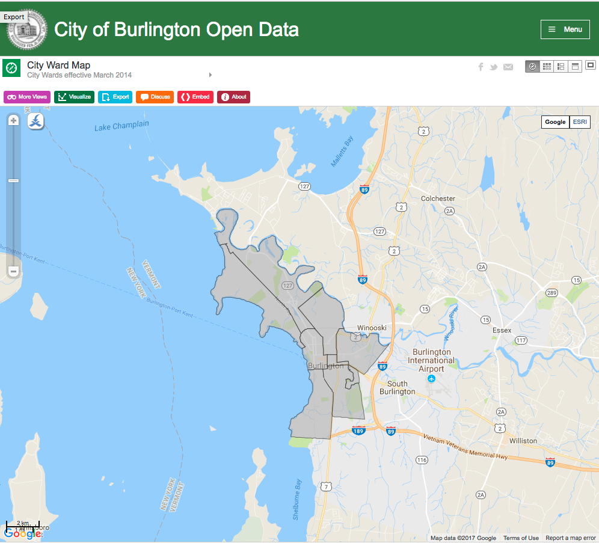
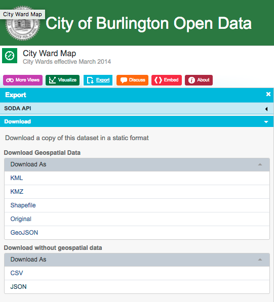

# Burlington Vermont City Wards

## What is this repo for?

Listing of the Burlington, Vermont data for wards for voting and city
councilors representation.

## Where is it from?

Downloaded exports from the Burlington Open City Data initiative:
[Link to data](https://data.burlingtonvt.gov/dataset/City-Ward-Map/y6p6-jz87)

## Export the latest dataset

All datasets have a timestamp visible as the commit date of the file.

If the current date of your viewing this repository is significantly later I would recommend exporting the files yourself by:

1. Visit [City Open Data Portal](https://data.burlingtonvt.gov/browse).
2. Search for `city ward map`
3. Select the matching result and export

